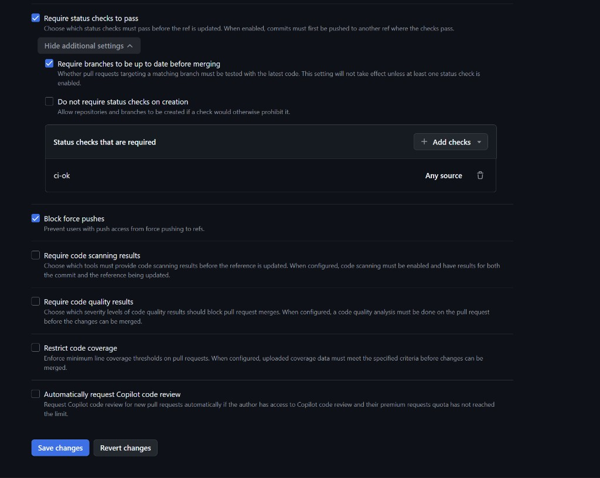
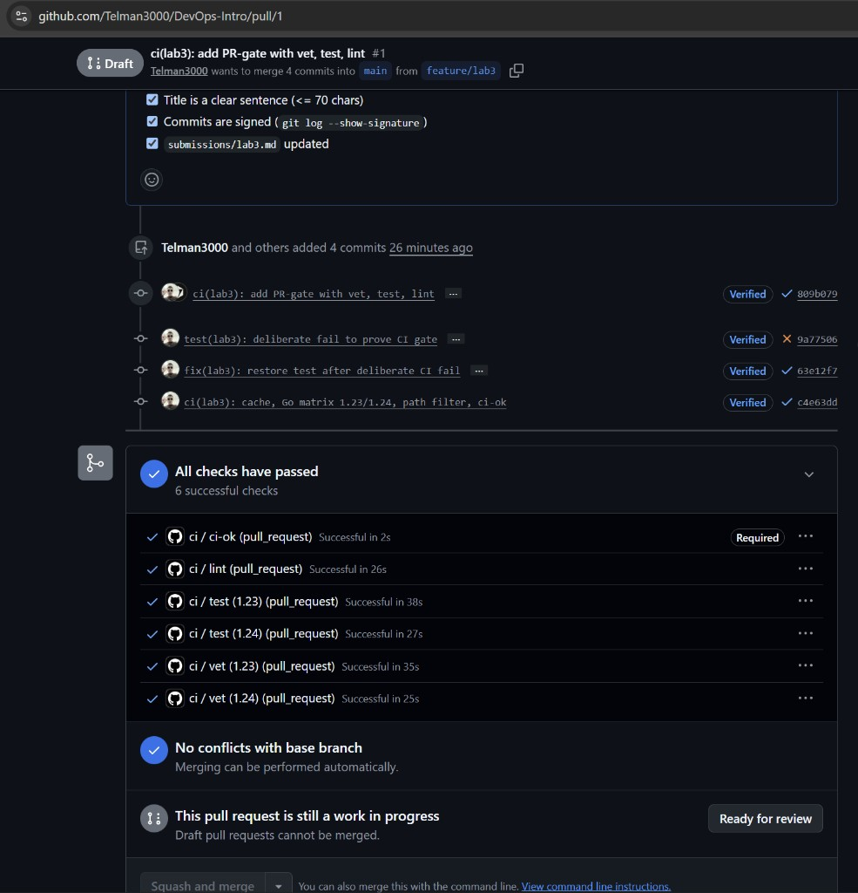
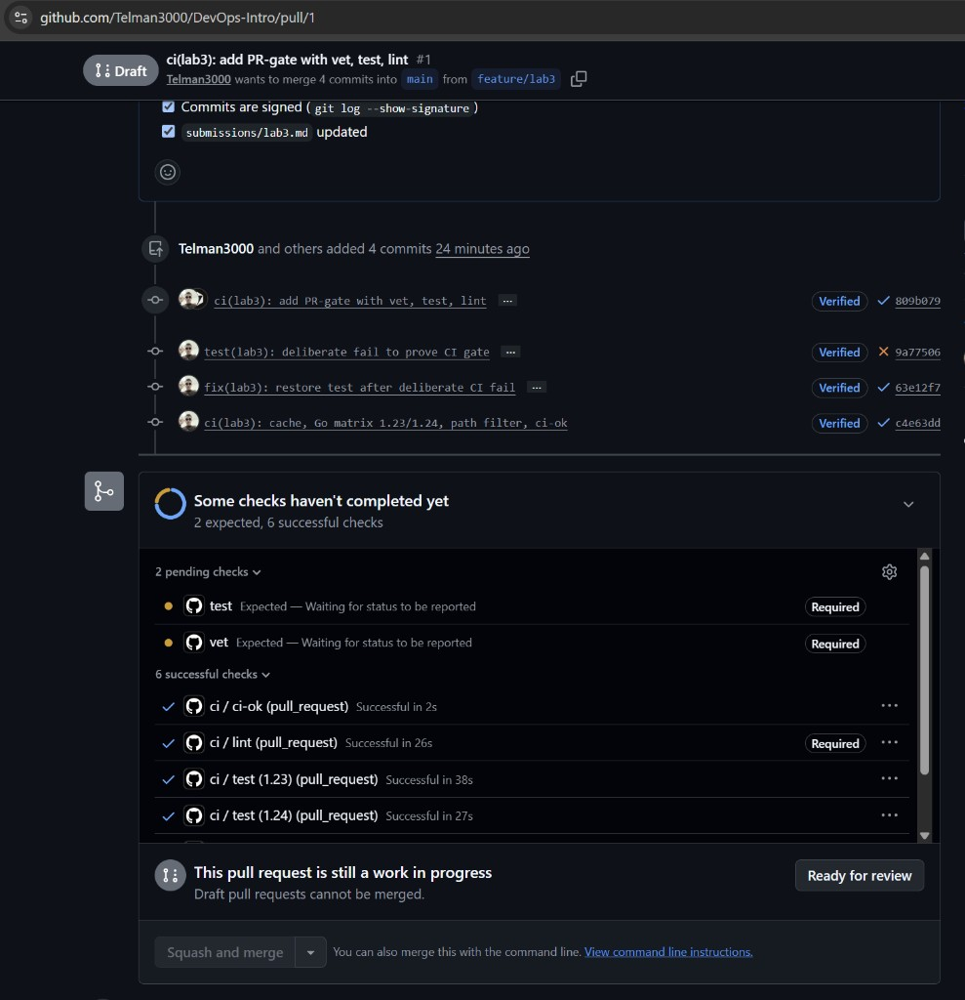

# Lab 3 submission

Author: Telman Nuruzov (`Telman3000`)
Branch: `feature/lab3`
Fork: https://github.com/Telman3000/DevOps-Intro
Path: **GitHub Actions** (default — can sign in to github.com)

Fork draft PR (CI gate validation): https://github.com/Telman3000/DevOps-Intro/pull/1  
Course PR: https://github.com/inno-devops-labs/DevOps-Intro/pull/1576

---

## Task 1 — PR gate (vet + test + lint)

### Evidence

- Workflow: `.github/workflows/ci.yml`
- Runner: `ubuntu-24.04` (pinned, not `ubuntu-latest`)
- Jobs: `vet`, `test` (`go test -race -count=1`), `lint` (golangci-lint **v2.5.0**)
- Actions pinned by full commit SHA; `permissions: contents: read`
- Working directory: `app/`

**Green CI run (Task 1 baseline, before matrix):**  
https://github.com/Telman3000/DevOps-Intro/actions/runs/35244829365

**Deliberate fail (Task 1.5)** — broke expected note ID in `app/store_test.go`, commit `9a77506`:  
https://github.com/Telman3000/DevOps-Intro/actions/runs/35245139268  
(`test` red; PR blocked by required checks)

**Fix** — restore test, commit `63e12f7`:  
https://github.com/Telman3000/DevOps-Intro/actions/runs/35245433254

**Branch protection (after Task 2):** ruleset on fork `main` requires status check **`ci-ok`** only, plus require branches up to date / block force pushes.

### Design questions (1.2)

**a) Why pin `ubuntu-24.04` instead of `ubuntu-latest`?**  
`ubuntu-latest` is a moving alias. When GitHub retargets it to a new LTS, packages, kernel, and tool defaults can change overnight and break a previously green pipeline with no commit of yours. A fixed label keeps the runner environment reproducible until you intentionally upgrade.

**b) Why split vet / test / lint?**  
Separate jobs run in parallel (faster wall-clock) and fail independently — you see *which* gate broke. One mega-job would serialize everything, hide the failing stage behind a single red X, and waste time re-running unrelated steps on every retry.

**c) What attack does SHA pinning prevent?**  
Tag-moving / compromised-action supply-chain attacks. In **March 2025**, **`tj-actions/changed-files`** was compromised: mutable tags were rewritten to malicious commits that exfiltrated CI secrets from thousands of public workflows (Lecture 3). Pinning the immutable 40-char commit SHA means a moved tag cannot silently change what you run.

**d) What is `permissions:`?**  
Workflow/job token scopes for `GITHUB_TOKEN`. Principle of least privilege: start with `contents: read` so a compromised step cannot push code, create releases, or mutate the repo unless you explicitly grant more.

**e) GitLab path (N/A)** — chose GitHub Actions.

---

## Task 2 — Cache + matrix + path filter

### Optimizations applied (description, not YAML)

1. **Cache** — `actions/setup-go` with `cache: true` (module + build cache keyed via `cache-dependency-path: app/go.mod`).
2. **Matrix** — `vet` and `test` run on Go **1.23** and **1.24** in parallel with `fail-fast: false`. Aggregation job **`ci-ok`** (`if: always()`, `needs: [vet, test, lint]`) is the single required check so matrix renames do not break branch protection.
3. **Path filter** — `on.push` / `on.pull_request` limited to `app/**` and `.github/workflows/**`, so docs-only changes do not burn CI minutes.

**Green run with cache + matrix + `ci-ok`:**  
https://github.com/Telman3000/DevOps-Intro/actions/runs/35246425757

After matrix, old required names `vet`/`test` sat at *Expected — Waiting…* until the ruleset was switched to **`ci-ok` only** (lab pitfall §2.2):

### Timing table (wall-clock of the workflow run)

| Scenario | Wall-clock | Evidence |
|----------|------------|----------|
| Baseline (no cache, single Go, no path filter) | **~29 s** | [run 35244829365](https://github.com/Telman3000/DevOps-Intro/actions/runs/35244829365) — jobs `vet` 17s / `test` 27s / `lint` 29s (parallel) |
| With cache | **~29 s** (same order as baseline) | Cache landed in the same commit as matrix; QuickNotes has **zero** third-party modules (`app/go.mod` has no `require`, no `go.sum`), so `setup-go` cache has almost nothing to restore. Wall-clock stays dominated by runner start + toolchain install — expected per lab §2.4. |
| With cache + matrix | **~44 s** | [run 35246425757](https://github.com/Telman3000/DevOps-Intro/actions/runs/35246425757) — slowest cell `test (1.23)` ~38s; `ci-ok` +2s after needs |

Per-step insight: total job time barely moves with cache on this repo; a dependency-heavy project would save on module download / build-cache restore inside `setup-go` and `go test`, not on runner provisioning.

### Path filter note

Configured on both `push` and `pull_request`. A PR that only touches `README.md` / `labs/**` / `submissions/**` (outside the path globs) should show **no** `ci` workflow run. *(Demo: open a tiny docs-only PR on the fork if graders want a live skip.)*

### Design questions (2.5)

**f) Why cache `go.sum`-keyed inputs, not build outputs?**  
Module contents are content-addressed and pinned by the lockfile — a hit means bit-identical deps. Build outputs can depend on toolchain flags, OS packages, and non-hermetic environment details; caching “whatever we produced last time” risks subtle skew. Keying on inputs keeps the cache a safe accelerator, not a source of unreproducible binaries.

**g) What does `fail-fast: false` change?**  
Default `fail-fast: true` cancels remaining matrix cells when one fails — you may never learn that *both* 1.23 and 1.24 broke. `false` lets every cell finish so you see the full failure surface. Use `true` when CI minutes are scarce and one failure is enough to reject the PR immediately (e.g. huge expensive matrices).

**h) Cache poisoning risk from a malicious PR?**  
A forked/malicious PR that can write to the Actions cache could plant tainted modules/artifacts that a later trusted workflow on `main` restores and executes/trusts. GitHub mitigates this by **scoping cache writes**: caches created from pull requests from forks (and related restrictions) are not freely readable by workflows on the default branch the way same-ref caches are — see GitHub’s docs on [Caching dependencies to speed up workflows](https://docs.github.com/en/actions/using-workflows/caching-dependencies-to-speed-up-workflows) / security hardening for Actions (cache isolation for PRs from forks). Still treat cache as an optimization layer, not a trust boundary.

---

## Bonus — Pipeline performance

**Target:** ≤ 90 s wall-clock. Task 2 matrix run was already **~44 s** ([run 35246425757](https://github.com/Telman3000/DevOps-Intro/actions/runs/35246425757)); bonus keeps that headroom and cuts avoidable work.

### B.1 Profile (Task 2 matrix run, before bonus)

| Phase | Approx. | Notes |
|-------|--------:|-------|
| Runner start / queue | ~3–5 s | Included in job start → first step |
| Dependency setup (`setup-go`, module/build cache) | ~10–15 s/job | Dominant *setup* cost; module cache nearly empty (no third-party deps) |
| Actual work | vet ~1–3 s; `go test -race` ~5–10 s; golangci ~5–10 s | Race build dominates real CPU work |
| Cleanup / artifacts | ~0 s | No artifact uploads |
| **Wall-clock (parallel jobs)** | **~44 s** | Bound by slowest cell: `test (1.23)` ~38 s + `ci-ok` ~2 s |

### B.2 Extra optimizations (≥ 3 beyond Task 2)

1. **`concurrency` + `cancel-in-progress`** — new pushes on the same PR cancel the previous run so minutes aren't spent on superseded SHAs.
2. **Shallow checkout (`fetch-depth: 1`) + `GOFLAGS=-buildvcs=false`** — less git data; skip VCS stamping that fails or wastes time on shallow clones.
3. **Skip golangci on docs-only `app/` changes** — `dorny/paths-filter` (SHA-pinned); if no `*.go` / lint config / `go.mod` / workflow change, lint job exits after a cheap filter step.
4. **golangci `install-mode: binary` + action cache** — avoid `go install` of the linter every run; reuse the action's binary cache.

(Lint already runs in parallel with vet/test from Task 2 — kept.)

### B.3 Before / after

| Optimization | Before (s) | After (s) | Saving |
|--------------|-----------:|----------:|-------:|
| 1 — concurrency cancel (stale PR runs) | full re-run wasted | cancelled | minutes on busy PRs (not one-shot wall) |
| 2 — shallow + `GOFLAGS=-buildvcs=false` | ~44 wall | **~43** wall | ~1 s (within runner noise) |
| 3 — skip lint on docs-only | lint ~26 s always | ~few s filter-only | ~20+ s on docs-only PRs |
| 4 — golangci binary install + cache | lint job ~26 s | lint job **~17 s** | **~9 s** on lint job |
| **Total wall-clock (Go-changing PR)** | **~44** | **~43** | **~1 s** (still **≪ 90 s**) |

After-bonus green run: https://github.com/Telman3000/DevOps-Intro/actions/runs/35248461719  
(`test (1.23)` 34s, `lint` 17s, `ci-ok` 4s; wall-clock ≈ 43 s)

### B.4 Bottleneck analysis

The remaining wall-clock is dominated by **GitHub-hosted runner bring-up + `actions/setup-go` toolchain install**, not by QuickNotes' tiny test suite — `go test -race` itself is only a few seconds once the toolchain is warm. Making the *code* shorter would barely move CI: you'd need fewer matrix cells, dropping `-race` on one version, or a pre-baked image/self-hosted runner with Go already installed. I'd stop optimizing around **~60–90 s** for this repo: below that, variance in queue/start time exceeds any local tweak, and further cuts trade safety (race, dual Go versions, lint) for noise. We already sit under the **90 s** bonus target with Task 2 alone; bonus work mainly protects minutes on docs-only and superseded pushes.
